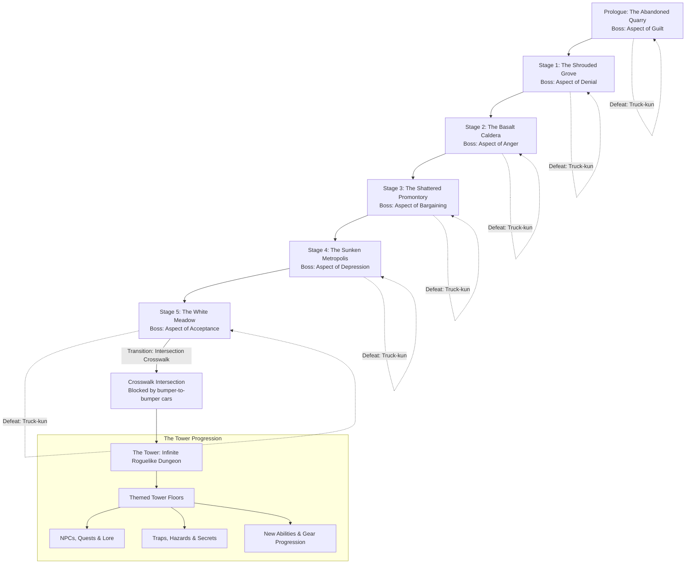

# Narrative Architecture: Story Progression & The Infinite Tower

## 1. Executive Summary & Narrative Metaphor

*Fornach* explores a narrative of amnesia, loss, and traumatic memory recovery wrapped in tactical combat. The protagonist died in a real-world vehicle collision failing to save their twin sister (Lyra). Trapped in an existential purgatory loop, the protagonist's combat encounters are externalized manifestations of their repressed psychological trauma.

Failure in combat triggers the sudden, absurd appearance of **"Truck-kun"**—a flatbed truck collision that violently pulls the protagonist back to the sensory horror of their fatal accident before rewinding the timeline to the stage checkpoint.

Overcoming each manifestation shatters the cognitive fog, unlocking suppressed memories. Conquering the final manifestation (Acceptance) dissolves the dreamscape into a physical crosswalk intersection, leading into **The Tower**: an unbounded roguelike dungeon crawl.

---

## 2. Narrative Arc & Progression Flow

---

## 3. Boss Manifestations & Chapter Mechanics

### Stage 1: Denial — *The Phantom of the Shrouded Grove*
* **Environment**: Dense, sunless pine forest suffocated by shifting fog banks.
* **Psychological Theme**: Refusal to accept reality; evasiveness; disassociative illusions.
* **Palette**: `[dim grey]`, `[darkgreen]`, `[cyan]`.
* **Stat Focus**: Extreme Finesse (110) & Reflex (115), low Fortitude (35).
* **Equipment**: *Veil of Distortions* (Cloak), *Twin Mirage Daggers*.
* **Combat Mechanics**:
  - **Spatial Decoys & Illusions**: Generates phantom signatures across the spatial grid (`Fov`/`Line`). Attacks against phantoms dissipate harmlessly.
  - **Damage Denial**: Evasive stance checks can nullify damage instances entirely, claiming "that blow never landed."
  - **Counterplay**: Trapping the boss against natural obstacles or utilizing caltrops/area crowd control to restrict mobility.
* **Memory Unlocked**: `"broken_umbrella"` — The memory of running out into the downpour after a bitter misunderstanding.

---

### Stage 2: Anger — *The Molten Juggernaut of the Basalt Caldera*
* **Environment**: Active volcanic caldera of black basalt, cracking magma plates, and blinding sulfur smoke.
* **Psychological Theme**: Destructive rage; blaming the universe; self-consuming fury.
* **Palette**: `[bold red]`, `[darkorange3]`, `[yellow3]`.
* **Stat Focus**: Enormous Force (140) & Prowess (95), zero Composure (0), moderate Fortitude (90).
* **Equipment**: *Slag-Forged Greatsword*, *Molten Carapace*.
* **Combat Mechanics**:
  - **Escalating Recklessness**: Starts at 40 Recklessness; gains +15 Recklessness each combat turn. Deals devastating offensive damage but exposes severe vulnerabilities.
  - **Caldera Heat Exhaustion**: Ambient heat forces periodic Fortitude checks, ticking health damage to anyone lingering without poise.
  - **Counterplay**: Defensive stances (Turtle / Fluid) and Poise stabilization to absorb the onslaught until the Juggernaut exhausts its dice pool into Collapse.
* **Memory Unlocked**: `"shouting_in_the_hallway"` — The recollection of harsh words screamed just minutes before the fatal crossing.

---

### Stage 3: Bargaining — *The Arbiter of the Shattered Promontory*
* **Environment**: Jagged cliff edge overlooking a tempestuous black sea, lashed by sideways gale-force rain.
* **Psychological Theme**: "If only..."; desperate transactions; attempting to negotiate with the inevitable.
* **Palette**: `[deepskyblue4]`, `[slateblue1]`, `[grey70]`.
* **Stat Focus**: High Acumen (100), Intellect (95), and Resolve (105). Balanced Force (65).
* **Equipment**: *Scales of Unequal Trade* (Focus), *Gale-Wind Rapier*.
* **Combat Mechanics**:
  - **The Desperate Pact**: Offers turn-by-turn trades (e.g., gain +2 Offensive dice this round in exchange for losing 30 Morale or suffering Armor decay).
  - **Cliffside Hazards**: Positional knockbacks test `Distance` from the cliff edge. Pushing or being pushed threatens lethal falls.
  - **Counterplay**: Discerning true bargains from traps; exploiting the Arbiter's hesitation when its trades are refused.
* **Memory Unlocked**: `"hospital_monitors"` — The desperate, quiet bargains whispered into the dark at an intensive care bedside.

---

### Stage 4: Depression — *The Drowned Sovereign of the Sunken Metropolis*
* **Environment**: Waterlogged, crumbling stone ruins of a collapsed metropolis echoing with damp silence.
* **Psychological Theme**: Total lethargy; emotional paralysis; numbness; feeling submerged under crushing weight.
* **Palette**: `[steelblue]`, `[darkslategray]`, `[dim]`.
* **Stat Focus**: Massive Fortitude (135), High Composure (110), low Force (30), low Reflex (25).
* **Equipment**: *Anchor of Apathy* (Heavy Weapon), *Shroud of Still Waters* (Armor).
* **Combat Mechanics**:
  - **Cognitive Doldrums**: Emits a passive aura doubling all Cognitive Fatigue accumulated by the player.
  - **Morale Leech**: Once Cognitive Fatigue reaches critical capacity, actions deplete Morale directly. The boss attacks morale integrity rather than pure health.
  - **Counterplay**: Meditative stance shifts, rally actions, and focused burst strikes to avoid a prolonged war of mental attrition.
* **Memory Unlocked**: `"empty_bedroom"` — The suffocating stillness of walking past an untouched bedroom.

---

### Stage 5: Acceptance — *The Crossing Guardian of the White Meadow*
* **Environment**: A boundless, radiant meadow of white lilies under warm, cloudless sunlight.
* **Psychological Theme**: Forgiveness; releasing the illusion of control; honoring memory without despair.
* **Palette**: `[bold white on grey0]`, `[gold1]`, `[springgreen3]`.
* **Stat Focus**: Dynamic mirror of the protagonist's current stats and equipment loadout.
* **Equipment**: Mirrored gear reflecting the player's choices across the prologue and prior stages.
* **Combat Mechanics**:
  - **The Mirror Duel**: Matches the player's stance and action pool.
  - **The Pacifist Resolution**: Combat is not won by slaughter. Striking the guardian causes it to reform endlessly. True victory is achieved by lowering weapons, selecting "Yield" / "Embrace", or letting combat stances settle into peaceful equilibrium.
* **Memory Unlocked**: `"twin_smile"` — The crystal-clear, unclouded memory of Lyra smiling peacefully and bidding farewell.

---

## 4. The Intersection & The Infinite Tower

### The Crosswalk Transition
Upon achieving Acceptance:
1. The white lilies and radiant meadow shimmer and dissolve.
2. The environmental sound shifts from breeze to the distant drone of idling car engines, rain falling on warm asphalt, and the hum of traffic signals.
3. The protagonist stands at a pedestrian crosswalk. On both the left and right, endless gridlocked lines of cars with headlights blazing form an impassable barrier.
4. Directly across the pedestrian crossing, where the accident occurred, stands an imposing, ancient stone monolith: **The Tower**.
5. Crossing the crosswalk allows the protagonist to leave the loop of their past trauma behind and push open the great bronze doors of the Tower.

### The Infinite Roguelike Dungeon
Once inside the Tower, spatial and psychological restrictions dissolve into open, dynamic dungeon exploration:
* **Themed Procedural Floors**: Each sector of the Tower presents distinct biomes, architectures, and tile sets (e.g., Crypt of Lost Regrets, Clockwork Spire, Library of Forgotten Names).
* **Enemies & Bosses**: Diverse enemy archetypes with tactical AI behaviors leveraging `Fornach.Spatial` line-of-sight, field-of-view, and pathfinding.
* **Traps & Environmental Hazards**: Pressure plates, dart corridors, collapsing floors, and elemental hazards.
* **NPCs, Lore & Quests**: Lost travelers, spectral merchants, and eccentric scholars who provide side objectives, persistent lore, and critical resources.
* **Long-Term Progression**: Unlocking new weapons, armor sets, combat stances, and tactical preparations as the player ascends deeper into the Tower.
